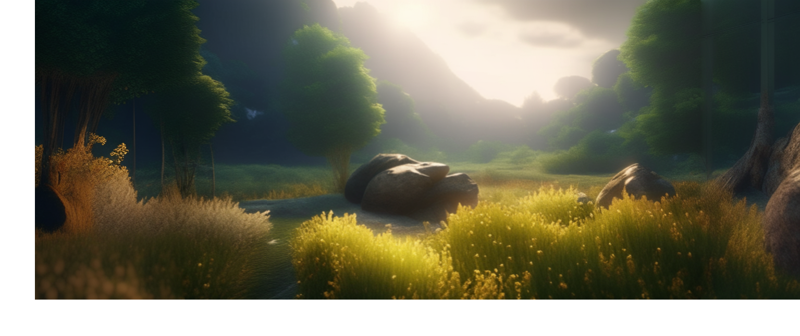

# 3DViewer 

## Contents

1. [Описание](#описание)
2. [Настройки](#настройки)
3. [Запись](#запись)
4. [Текстурирование](#текстурирование)

## Описание
Программа разработана для визуализации модели в трехмерном пространстве.

- Программа разработана на языке C++ стандарта C++17
- При написании кода придерживались Google Style
- Сборка программы настроена с помощью Makefile со стандартным набором целей для GNU-программ: all, install, uninstall, clean, dvi, dist, tests.
- Программа разработана в соответствии с принципами объектно-ориентированного программирования
- Покрытие unit-тестами
- В программе реализован графический пользовательский интерфейс, на базе Qt.
- Графический пользовательский интерфейс содержит:
    - Кнопку для выбора файла с моделью и поле для вывода его названия.
    - Зону визуализации модели.
    - Кнопку/кнопки и поля ввода для перемещения модели.
    - Кнопку/кнопки и поля ввода для поворота модели.
    - Кнопку/кнопки и поля ввода для масштабирования модели.
    - Информацию о загруженной модели - название файла, кол-во вершин и ребер.
- Программа корректно обрабатывает и позволяет пользователю просматривать модели с деталями до 1 000 000 вершин без зависания (зависание - это бездействие интерфейса более 0,5 секунды).
- Программа реализована с использованием паттерна MVC.
- Для осуществления аффинных преобразований используются матрицы из библиотеки из предыдущего проекта [MatrixPlus](https://github.com/VAKoleso/MatrixPlus)

## Настройки
- Программа предоставляет возможность:
    - Загружать модель из файла формата obj.
    - Перемещать модель на заданное расстояние относительно осей X, Y, Z.
    - Поворачивать модель на заданный угол относительно своих осей X, Y, Z.
    - Масштабировать модель на заданное значение.
    - Переключать тип отображения объекта: каркасная модель, плоское затенение, мягкое затенение (методом Гуро или методом Фонга).
    - Задавать источник освещения, его базовую интенсивность (через три компоненты: R, G, B) и положение.
    - Настраивать тип проекции (параллельная и центральная)
    - Настраивать тип (сплошная, пунктирная), цвет и толщину ребер, способ отображения (отсутствует, круг, квадрат), цвет и размер вершин
    - Выбирать цвет фона
    - Выбирать базовый цвет объекта
    - Настройки сохраняются между перезапусками программы

## Запись

- Программа позволяет сохранять полученные изображения в файл в форматах bmp и jpeg
- Программа позволяет по специальной кнопке записывать небольшие "скринкасты" - текущие пользовательские аффинные преобразования загруженного объекта в gif-анимацию (640x480, 10fps, 5s)
- Программа позволяет по специальной кнопке сохранять короткое превью модели - gif-анимацию (640x480, 10fps, 5s) с вращением объекта вокруг одной оси.

## Текстурирование

- Программа позволяет наносить текстуру на объект, имеющий uv-развертку.
- При загрузке модели с uv-разметкой, станет доступной кнопка "Нанести текстуру", которая позволяет выбрать файл текстуры
- Разрешение файла текстуры не может превышать 1024x1024 пикселей
- Файл текстуры должен иметь расширение BMP
- Текстура может быть только квадратной, координаты всегда нормируются к значениям от 0 до 1
- Текстура не отображается в режиме каркасной модели
- После загрузки текстуры в интерфейсе программы станет доступной кнопка "Снять текстуру", после которой текстура выгружается из памяти программы и перестает отображаться на модели
- UV-карта модели считывается из obj-файла
